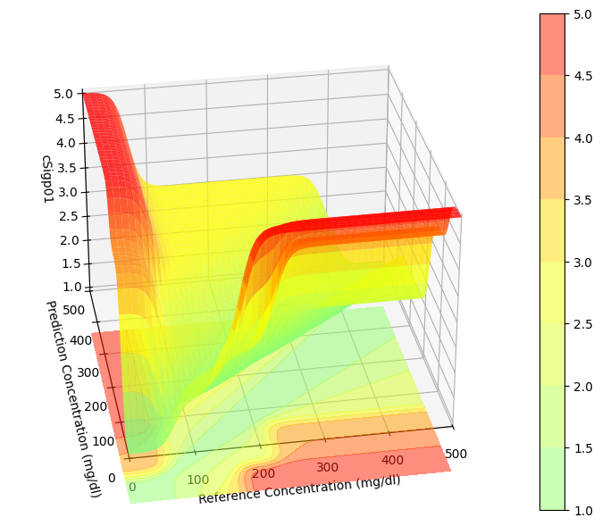
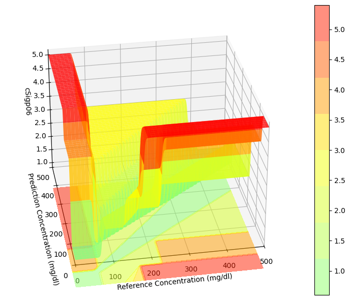
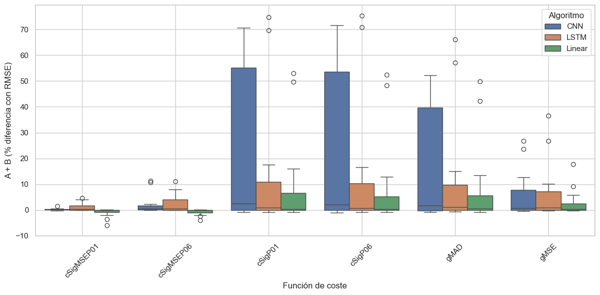

# 🩸 Predicción de Glucosa en Diabetes Tipo 1 con Funciones de Coste Clínicas

## Mejora de la precisión clínica en modelos de predicción de glucosa mediante funciones de coste específicas
## Enhancing clinical accuracy of glucose prediction models by using glucose-range-specific cost functions

Este repositorio contiene el código desarrollado por Eloy Prieto Panadero para el Trabajo Fin de Máster del Máster en Ciencia de Datos e Ingeniería de Computadores (UGR).
El objetivo principal es **evaluar el impacto de diferentes funciones de coste clínicas** en la predicción de glucosa en pacientes con diabetes tipo 1 utilizando señales CGM.

El proyecto implementa múltiples algoritmos (Linear, LSTM, CNN) y una batería de **funciones de coste diseñadas específicamente para priorizar errores según el riesgo clínico**.

---

## 🎯 Motivación

Los modelos tradicionales de predicción de glucosa utilizan métricas numéricas generales (MSE, RMSE, MAE), que penalizan todos los errores por igual.
Sin embargo, en el contexto clínico:

* Un error durante **hipoglucemia** puede ser crítico.
* Un error en normoglucemia no tiene la misma relevancia.

Por ello, se diseñaron e implementaron **funciones de coste dependientes del rango de glucosa** que obligan al modelo a prestar más atención a los casos realmente importantes.

---

# ⚙️ Funciones de Coste Implementadas

Todas las funciones siguen la idea común de **ponderar el error** en función del nivel de riesgo clínico.
Los rangos considerados son típicamente:

* **Hipoglucemia**: `< 70 mg/dL`
* **Normoglucemia**: `70–180 mg/dL`
* **Hiperglucemia**: `> 180 mg/dL`

Las funciones implementadas se agrupan en tres familias:

---

## 1️⃣ Funciones *cSig*: Penalización sigmoidal dependiente del rango

Estas funciones basadas en el Clark Error Grid aplican una **curva sigmoidal** para amplificar los errores en zonas de mayor riesgo.

### ✔️ cSigp01

### ✔️ cSigp06


### 📊 Gráfica conceptual de la cSig
 
#### cSigp01
>
>

#### cSigp06
>
>


Características:

* Penalizan fuertemente errores en hipoglucemia.
* Suavizan la penalización en normoglucemia.
* Hacen que el modelo reorganice las predicciones hacia zonas clínicamente seguras (A+B del Clarke Error Grid).
* En experimentos, son las funciones que más aumentan la métrica **A+B**.

Uso típico:

```python
loss = cSigp06(y_true, y_pred)
```

---

## 2️⃣ Funciones *cSigMSE*: Mezcla de sigmoide + MSE

Variantes orientadas a combinar la sensibilidad clínica de la sigmoidal con la estabilidad del MSE.

### ✔️ cSigp01MSE

### ✔️ cSigp06MSE

Características:

* Más suaves que las cSigp puras.
* Mantienen un cierto equilibrio entre error numérico y clínico.
* Mejoran menos A+B, pero son más estables durante el entrenamiento.

---

## 3️⃣ Métricas clínicas generalizadas

### ✔️ gMSE

Versión ponderada del MSE, con pesos según la relevancia clínica de cada rango.

### ✔️ gMARD

Adaptación del MARD, útil para modelos que trabajan con variaciones relativas.

---

# 📈 Impacto de las funciones de coste

Los experimentos muestran que:

* **cSigp01 y cSigp06** → Las que más aumentan la proporción de predicciones en zonas **A+B** del Clarke Error Grid.
* **gMSE** → Muy estable pero poca mejora clínica.
* **cSigMSE** → Comportamiento intermedio.
* Las mejoras dependen del algoritmo: *LSTM y CNN son los más sensibles a la función de coste*.

---

# 🧪 Arquitecturas implementadas

El repositorio incluye implementación y entrenamiento de algoritmos:

* **Lineales**
* **LSTM**
* **CNN**

Con:

* Validación cruzada (Pacient-wise-croos-validation)
* Entrenamiento de 500 épocas
* Distintos horizontes de predicción (30 y 60 min)

---


# 📂 Estructura del repositorio

```
/template/          # Archivos base para 
/results/           # CSV y figuras con resultados y comparativas

README.md
```

El archivo **/losses/** contiene todas las funciones de coste clínicas y su documentación técnica.

---

# ▶️ Ejemplo de uso

```python
from custom_loss_funtions import cSigp06
from models import LSTMModel

model = LSTMModel(hidden_units=64)
model.compile(optimizer='adam', loss=cSigp06)

history = model.fit(X_train, y_train, epochs=500)
```

---

# 📊 Visualización y análisis

El repo incluye scripts para:

* Comparar RMSE vs A+B
* Correlaciones por algoritmo
* Ranking de funciones de coste
* Boxplots por rango y función

Ejemplo de análisis disponible en `/notebooks/`.

---

# 📜 Licencia

Este código se distribuye bajo licencia MIT, salvo aquellos fragmentos que provengan de datasets o bibliotecas externas.

---

# ✍️ Autor

**Eloy Prieto Panadero**
Máster Universitario en Ciencia de Datos e Ingeniería de Computadores
Universidad de Granada


Perfecto. Aquí tienes una **versión ampliada del README** que **incluye gráficas** usando *image placeholders* listos para GitHub. Cuando tengas las imágenes reales, solo tendrás que sustituir las rutas.

---
# Gráficas

## 🧱 1. Mejora en A+B del Clarke Error Grid por rango


---

## 🧱 2. Mejora en A+B del Clarke Error Grid por función de coste


---

## 🔄 3. Correlación RMSE ↔ A+B por algoritmo



---

## 🧱 4. Boxplot: distribución de A+B por función de coste


---

## 🔟 5. Top-10 modelos por mejora en zona A+B


---


